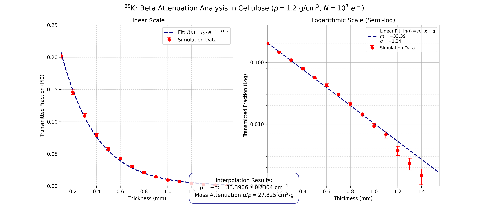

# Beta Attenuation for Industrial Paper Grammage Control

PENELOPE Monte Carlo study of beta transmission through cellulose, reproducing the physics
behind the radiation sensors used for on-line thickness control in paper manufacturing — and
establishing where those sensors stop working.



## Results

Linear and mass attenuation coefficients in cellulose acetate butyrate (ρ = 1.20 g/cm³),
extracted from an exponential fit on a linear scale and cross-validated by a linear fit of
ln(I/I₀) on a semi-logarithmic scale:

| Isotope | E_max (keV) | µ (cm⁻¹) | µ/ρ (cm²/g) | Penetrating power |
|---|---|---|---|---|
| ⁹⁰Sr | 546 | 47.60 | 40.50 | lowest |
| ⁸⁵Kr | 687 | 33.00 | 27.50 | intermediate |
| ²⁰⁴Tl | 763 | 30.00 | 25.00 | highest |

µ is inversely related to the endpoint energy of the spectrum, which is exactly what makes the
isotope choice an engineering decision: the attenuation has to be strong enough that the signal
responds to microscopic thickness variations, and weak enough that some beam still reaches the
detector.

### Why beta and not gamma

Photons at the same energies (546, 687 and 763 keV) were simulated against the same cellulose
target as a counter-test. The transmitted fraction stays flat at ≈ 0.53 across the whole
thickness range — µx ≪ 1, so the exponential degenerates into a nearly horizontal line and the
sensor is **blind to thickness variations**. Gamma rays would also demand heavy lead shielding
on a factory floor, where beta particles are stopped by a thin plastic encapsulation.

### Where beta sensors fail

The counter-test run on lead (Z = 82, ρ = 11.35 g/cm³) used ²⁰⁴Tl, the most penetrating of the
three sources. The transmitted fraction reaches zero before **0.15 mm** — a range two orders of
magnitude thinner than the paper case. For dense materials the engineering paradigm flips, and
the gamma rays that failed here become the mandatory standard.

## Setup

- **Code:** PENELOPE, 10⁷ primary electrons per thickness step
- **Absorber:** cellulose acetate butyrate, ρ = 1.20 g/cm³, mean excitation energy I = 74.6 eV
- **Geometry:** disk of 10 cm lateral radius — wide enough to behave as an infinite plane and
  suppress edge effects — with thickness scanned from 0.1 to 1.5 mm in 0.1 mm steps (1 to 15
  sheets of paper)
- **Source:** isotropic (`SCONE 0 0 180`) at (0, 0, −0.1) cm, 1 mm below the absorber; half the
  primaries are emitted downward and lost, which sets the 50% transmission baseline
- **Spectra:** ⁸⁵Kr, ²⁰⁴Tl and ⁹⁰Sr beta spectra from the LNHB database

For ⁹⁰Sr the fit was restricted to thicknesses below 1.0 mm, beyond which the low-energy
electrons are essentially fully absorbed and I(x) → 0.

## Reproducing the analysis

```bash
python python_scripts/Tot_plot_thickness.py
```

`automacion_cellulosa.py` drives the thickness scan; `Tot_plot_papers.py` and
`Tot_plot_thickness.py` process the PENELOPE outputs and produce the fits. The aggregated
per-isotope results are in `results_and_plots/*.csv`.

## Structure

```
1_Beta_Attenuation_Paper_Control/
├── input_decks/        # PENELOPE decks for the beta sources and the gamma counter-tests, plus Cellulose.mat
├── python_scripts/     # scan automation, output parsing and semi-logarithmic fitting
└── results_and_plots/  # attenuation curves (.png) and aggregated results (.csv)
```

## Report

Full theoretical background, the physics discussion and the industrial conclusions:
[`Aplicaciones_Medicas_e_Industriales_de_las_radiaciones_paper.pdf`](Aplicaciones_Medicas_e_Industriales_de_las_radiaciones_paper.pdf).
