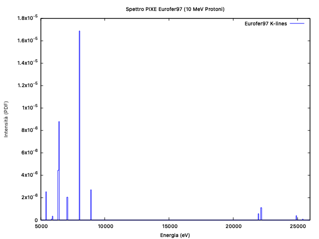

# PIXE Simulations for Material Characterization

Proton-Induced X-ray Emission modelled with PENELOPE (`penh`), from pure elements up to
multi-element industrial alloys, with every simulated peak checked against the Evaluated Atomic
Data Library (EADL) in Siegbahn notation.



## Results

All targets were irradiated with a **10 MeV proton beam**, except silver, which was also used
for an energy-dependence study from 5 to 50 MeV.

| Target | ρ (g/cm³) | Composition | What the spectrum resolves |
|---|---|---|---|
| Silver (Ag) | 10.50 | pure, Z = 47 | Kα doublet and Kβ multiplet, 21–26 keV |
| Bronze (Cu-Sn) | 8.00 | Cu 86.9%, Sn 13.1% | Cu K-series at ~8.0 keV over Sn at ~25.2 keV |
| Eurofer97 steel | 7.80 | Fe 88.35%, Cr 8.58%, others 3.07% | Fe-Cr matrix **and Mn at 0.43% mass** |
| White gold (Au-Ag-Pd) | 13.00 | Au 58%, Ag 32.2%, Pd 9.5% | Au L-series (9–14 keV), Ag/Pd K-series (21–25 keV) |

Agreement with the EADL tabulated transition energies is at the level of a few eV to a few tens
of eV throughout — for example Ag Kα1 at 22139.0 eV theoretical against ~22140 eV simulated, and
Au Lα1 at 9709.8 eV against ~9710 eV.

Three results worth singling out:

**Trace sensitivity.** Eurofer97 resolves manganese at 0.43% mass fraction alongside the
dominant Fe-Cr matrix, which is the regime where PIXE is actually used analytically.

**Quantitative accuracy.** In white gold, silver (Z = 47) and palladium (Z = 46) have almost
identical ionisation cross-sections, so their Kα intensity ratio should track their mass ratio
directly. The simulated ratio is **~3.4** against a nominal 32.20/9.50 ≈ **3.4**.

**Shell selection.** Gold's K-shell binding energy is ~80.7 keV, far above what a 10 MeV proton
beam can excite efficiently, so no Au K-lines appear. The L-series (~11.9 keV) carries the
gold fingerprint instead — a reminder that the accessible fingerprint depends on the beam, not
only on the element.

**Energy dependence.** Raising the proton energy from 5 to 50 MeV on the silver target increases
the peak intensities substantially, as the inner-shell ionisation probability grows, while the
peak *positions* stay fixed — the emission energy is a property of the atom, not of how the
vacancy was created.

## Structure

```
2_PIXE_Material_Characterization/
├── input_decks/        # PENELOPE/penh inputs (.in), target geometry (disc.geo), material files (.mat)
└── results_and_plots/  # simulated emission spectra
```

Decks are named by target: `pixe_Ag_10MeV`, `pixe_Cu`, `pixe_Bronze`, `pixe_Eurofer97`,
`pixe_WhiteGold_14k` and `pixe_WhiteGold_18k`.

## Report

Complete physical analysis, methodology and the full peak-by-peak comparison with EADL:
[`Aplicaciones_Medicas_e_Industriales_de_las_radiaciones_paper__X_ray_.pdf`](Aplicaciones_Medicas_e_Industriales_de_las_radiaciones_paper__X_ray_.pdf).
