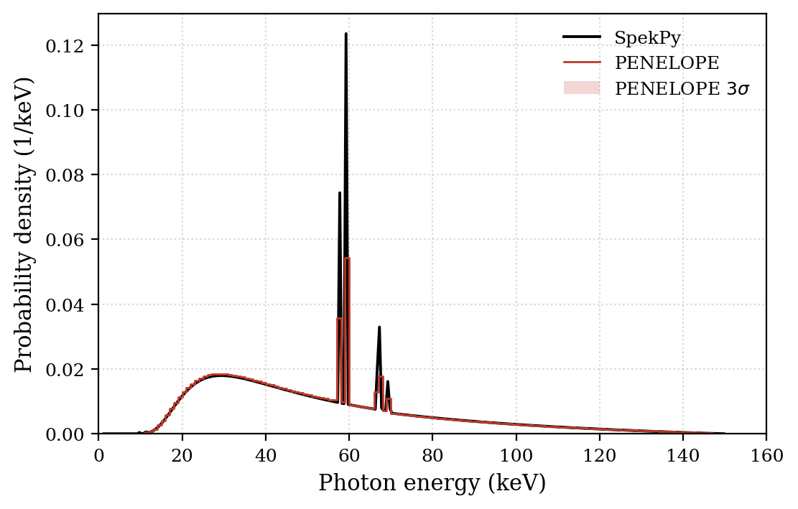

# X-ray Tube Spectrum Simulation

Photon spectra emerging from an X-ray tube, simulated with PENELOPE (`penmain`) and
**cross-validated against the SpekPy v2 semi-empirical toolkit** run under identical conditions.
Six configurations isolate the effect of beam energy, anode material and tube geometry.



## The six runs

| # | E₀ (keV) | Anode | Angle | Al filter |
|---|---|---|---|---|
| 1 | 150 | W | 45° | 1 mm |
| 2 | 28 | W | 45° | 1 mm |
| 3 | 28 | Mo | 45° | 1 mm |
| 4 | 150 | W | 20° | 2 mm |
| 5 | 28 | W | 20° | 2 mm |
| 6 | 28 | Mo | 20° | 2 mm |

## Results

**Baseline (W, 150 keV).** Bremsstrahlung continuum from ~10 keV to the kinematic endpoint at
150 keV, peaking near 30 keV, with the W characteristic K-lines at Kα ≃ 58–60 keV and
Kβ ≃ 67–70 keV. The low-energy cut-off is set by the 1 mm Al filter, the high-energy edge by the
incident electron energy.

**Beam energy, 150 → 28 keV.** Three distinct changes: the endpoint drops into the mammographic
window; the W K-lines vanish entirely, because the W K-shell binding energy (~69.5 keV) is far
above the available kinetic energy; and the Al filter now removes a much larger fraction of the
spectrum, leaving a narrow distribution around 20–25 keV.

**Anode material, W → Mo at 28 keV.** The Mo K-shell binding energy (~20.0 keV) sits *below*
E₀ = 28 keV, so the K-shell ionises efficiently and the characteristic lines reappear —
**Kα at ~17.5 keV and Kβ at ~19.6 keV**, dominating a weak bremsstrahlung pedestal. This is the
physical reason mammography tubes use molybdenum rather than tungsten.

**Geometry and filtration, 45°/1 mm → 20°/2 mm.** Two effects push the same way: the shallower
anode tilt lengthens the photon path inside the target (anode self-attenuation), and the doubled
aluminium removes soft photons. The net result is beam hardening in all three configurations —
but strongly energy-dependent. At 150 keV the shift is mild and the K-line region is unchanged;
at 28 keV, where the Al attenuation coefficient is far higher, the continuum peak moves visibly
upward and the spectrum narrows.

**PENELOPE vs SpekPy.** The two codes agree on line positions and continuum shape across all six
configurations. The systematic differences are understood and consistent: K-line peak amplitudes
differ slightly (different K-shell fluorescence-yield tabulations), PENELOPE's finite bin width
broadens the lines and lowers their apparent height even when the integrated intensity matches,
and small deviations appear in the low-energy tail, the region most sensitive to PENELOPE's
transport cut-offs.

## Setup

Based on `example 5` of the PENELOPE-2018 `penmain` distribution: a tilted anode bombarded by a
monoenergetic electron beam, an aluminium filter, and a silicon disc acting as impact detector.

- Anode angle is set through the `THETA` angle of the limiting plane in `tube.geo`
  (−135° for 45°, −160° for 20°); filter thickness through the z-coordinate of its lower face
  (−5.1 → −5.2 cm)
- Bremsstrahlung and characteristic-X-ray splitting factor 4, with interaction forcing
- For the 28 keV cases, absorption energies lowered from 5 keV to **1 keV** to track the Mo
  K-lines below 20 keV and the soft bremsstrahlung tail
- Both spectra use the fluence option (`flu=True`) and are area-normalised for shape comparison

## Reproducing the figures

```bash
python python_scripts/make_figures.py
```

## Structure

```
3_XRay_Tube_Spectrum_Simulation/
├── input_decks/        # 6 penmain inputs, 2 tube geometries (45°/20°), material files
├── python_scripts/     # make_figures.py, SpekPy comparison notebook
└── results_and_plots/  # individual spectra and the PENELOPE/SpekPy overlays
```

## Report

Full methodology, physical analysis and the complete set of comparisons:
[`Aplicaciones_Medicas_y_Industriales_de_las_Radiaciones__Tubo_X_ray.pdf`](Aplicaciones_Medicas_y_Industriales_de_las_Radiaciones__Tubo_X_ray.pdf).
