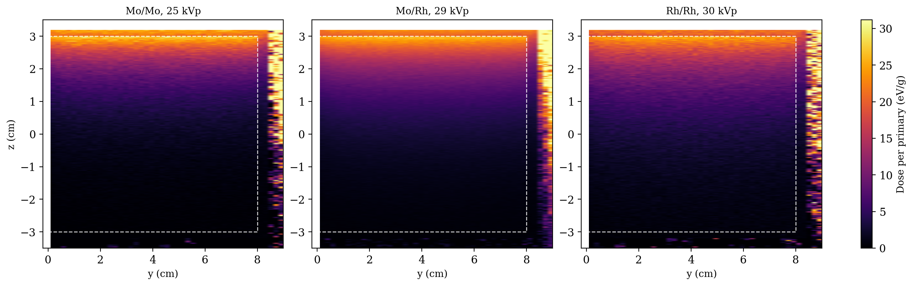

# Mammographic Dosimetry and PET Simulations

PENELOPE (`penmain`) dose calculations in a breast phantom across three clinical mammographic
spectra and three tissue compositions, carried through to a physical dose in mGy. Plus
preliminary positron transport simulations for PET.



## Results

### Spectrum comparison (glandular 50%, 5 cm)

| Spectrum | ⟨E_breast⟩ (eV/photon) | ⟨E_skin⟩ (eV/photon) | breast/skin |
|---|---|---|---|
| Mo/Mo, 25 kVp | 2926.6 ± 1.3 | 817.2 ± 0.7 | 3.58 |
| Mo/Rh, 29 kVp | 3418.1 ± 0.7 | 816.9 ± 0.3 | 4.18 |
| Rh/Rh, 30 kVp | 3555.0 ± 1.6 | 803.0 ± 0.8 | 4.43 |

As the beam hardens the breast contribution rises from ~2.9 to ~3.6 keV per photon while the
skin contribution stays essentially flat at ~0.8 keV — so the breast-to-skin ratio improves
monotonically. Softer beams deposit proportionally more energy near the surface; harder beams
penetrate deeper at a smaller skin cost.

### Absolute dose

Converting the per-photon energy into a physical dose, for the Rh/Rh 30 kVp beam at 100 mAs:

| Quantity | Value |
|---|---|
| SpekPy fluence at d = 100 cm | 2.27×10⁷ photons/cm²/mAs |
| Beam-cone area at d = 100 cm | 977 cm² |
| Total photons in the cone | 2.22×10¹² |
| Breast mass (half-cylinder, glandular 50%) | 493.5 g |
| Total energy deposited | 1.20×10⁻³ J |
| **Average breast dose** | **2.43 mGy** |

### Effect of glandularity (Rh/Rh, 30 kVp)

| Composition | ρ (g/cm³) | Mass (g) | ⟨ε⟩ (eV/γ) | ⟨D⟩ (mGy) |
|---|---|---|---|---|
| Glandular 0% (adipose) | 0.93010 | 467.5 | 3066.7 ± 2.3 | 2.33 ± 0.002 |
| Glandular 50% | 0.98190 | 493.5 | 3363.8 ± 1.1 | 2.43 ± 0.001 |
| Glandular 100% | 1.04000 | 522.8 | 3565.9 ± 0.9 | 2.43 ± 0.001 |

At the entrance face the fully glandular tissue absorbs **~27% more** than the adipose one. Only
about 12% of that comes from the density difference; the rest comes from the higher effective
atomic number of glandular tissue (more carbon and oxygen, less hydrogen), which strengthens the
photoelectric contribution in the 10–30 keV window.

The integrated dose behaves differently, and this is the non-obvious result: **the 50% and 100%
values agree within statistics**, because the rise in energy deposited per photon is largely
cancelled by the corresponding rise in irradiated mass.

## Setup

- **Geometry:** breast as a half-cylinder, r = 8 cm, h = 5 cm (h = 6 cm in the original
  template), surrounded by a 0.2 cm epithelial skin layer, between a polycarbonate compression
  plate and a perspex support, with a semi-infinite water slab as the patient's body
- **Source:** point isotropic photon emitter at z = 60 cm, 10° conical beam
- **Spectra:** generated with SpekPy v2 — Mo/Mo 25 kVp (thin breasts, ~4 cm), Mo/Rh 29 kVp
  (5–7 cm), Rh/Rh 30 kVp (>7 cm)
- **Settings:** absorption energies at 1 keV for electrons, photons and positrons; 3D dose grid
  of 100×100×300 voxels; ~10⁸ primary histories per run, giving ≲5% statistical uncertainty on
  the integrated dose
- **Outputs used:** `depth-dose.dat` (1D profile), `3d-dose-map.dat` (full map and
  dose-volume histogram), `energy-up.dat` / `energy-down.dat`

Five PENELOPE runs in total: the three spectra at 50% glandularity, plus 0% and 100% at Rh/Rh.

The PET component models positron transport and annihilation in bone, lead, water and air
(`PET-3.inp`).

## Structure

```
4_Mammography_and_PET_Simulations/
├── input_decks/        # penmain inputs for mammography and PET, geometries (mama.geo, mama_1.geo), materials
├── python_scripts/     # Mammography_Analysis.ipynb — dose extraction, attenuation coefficients, plotting
└── results_and_plots/  # spectra, depth-dose profiles, 2D dose maps, dose-volume histogram
```

## Report

Full derivation, all figures and the discussion:
[`Aplicaciones_Medicas_y_Industriales_de_las_Radiaciones__Mamografia.pdf`](Aplicaciones_Medicas_y_Industriales_de_las_Radiaciones__Mamografia.pdf).
A presentation of the same material is in [`Presentation_AMI.pdf`](Presentation_AMI.pdf).
