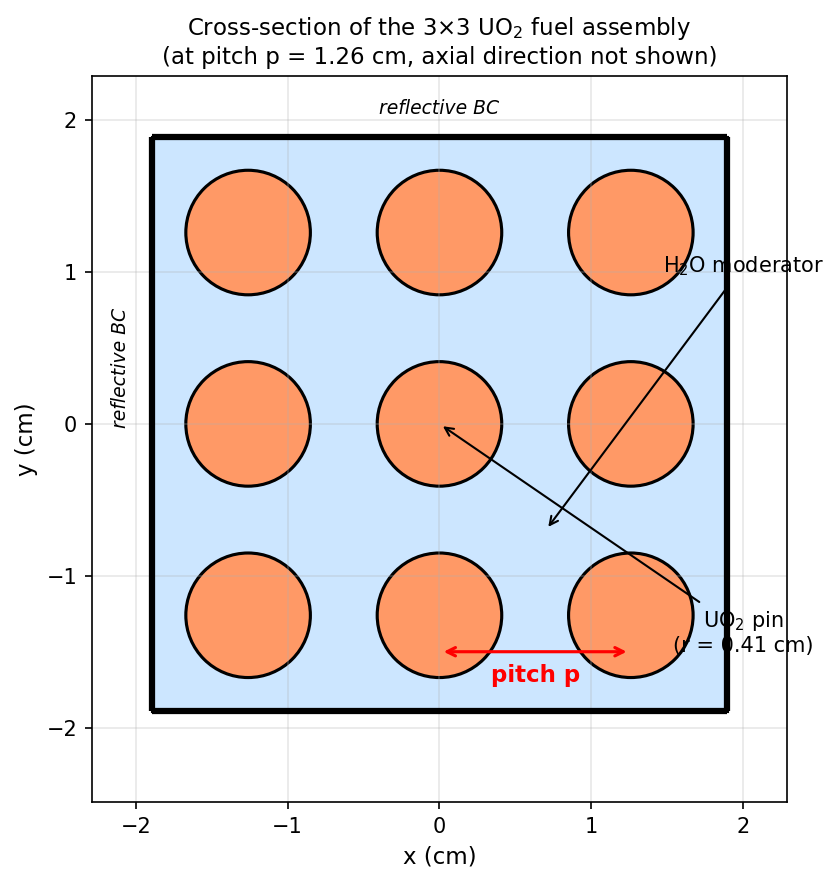
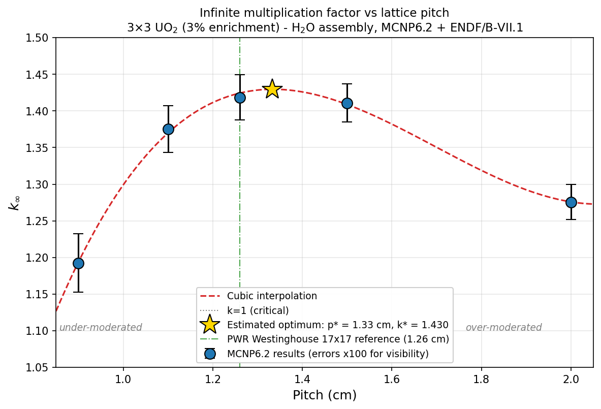
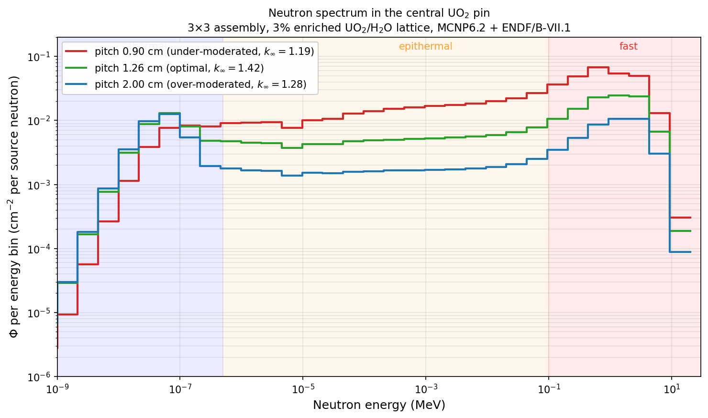
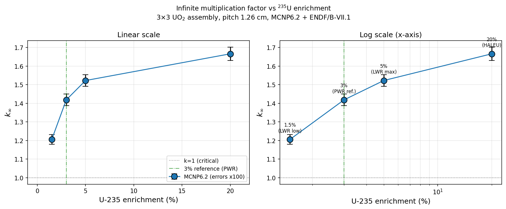

# MCNP Simulation of a PWR Fuel Assembly

Monte Carlo criticality study of an idealised 3×3 UO₂ lattice, benchmarked against the
Westinghouse 17×17 commercial fuel assembly. Run with **MCNP6.2** and the **ENDF/B-VII.1**
cross-section library.



## Results at a glance

| Quantity | Value |
|---|---|
| k∞ at the reference PWR configuration (p = 1.26 cm, 3% enrichment) | **1.41856 ± 0.00031** (0.022% rel.) |
| Predicted optimal lattice pitch (cubic fit) | **p\* = 1.33 cm**, k∞ᵐᵃˣ = 1.430 |
| Agreement with the Westinghouse 17×17 design pitch (1.26 cm) | **~5%** |
| Effect of PWR-hot moderator density (1.00 → 0.71 g/cm³) | **Δk∞/k∞ = −2.1%** |
| Thermal-to-fast flux ratio across the pitch scan | 0.108 → 0.821 (factor ~8) |

The negative reactivity response to reduced moderator density reproduces the self-stabilising
feedback of a real PWR: a rise in moderator temperature lowers the water density, decreases k∞,
and pushes the reactor back toward its operating point.

## Reproducing the results

The decks run on any MCNP6 installation with ENDF/B-VII.1:

```bash
mcnp6 i=input_decks/assembly_p126.txt o=out_p126.txt
```

Each run uses `kcode 10000 1.0 30 300` — 10 000 histories per cycle, 30 inactive and 300 active
cycles, for 3×10⁶ active neutron histories. Source points are placed at the centre of each fuel
pin via `ksrc`, updated consistently with the lattice pitch.

Deck naming: `assembly_pNNN` is the pitch scan (`p090` = 0.90 cm), `assembly_eNNN` the enrichment
scan (`e015` = 1.5%), the `_spec` suffix adds the F4 spectrum tally, and `_hot` uses the
PWR-operating moderator density. `Fision.txt` is the original course deck used for validation.

## Repository structure

```
Nuclear_Simulations/
├── MCNP_Final.pdf     # full report: theory, methods, results, discussion
├── input_decks/       # MCNP6 decks for the reference, pitch, enrichment and spectrum runs
└── pics/              # figures
```

## Model

A 3×3 array of cylindrical UO₂ pins (r = 0.41 cm, active height 10 cm, ρ = 10.40 g/cm³) in light
water, enclosed in a cubic cell whose half-side is exactly 1.5 p, so that each edge pin sits at
p/2 from the nearest face. Reflective boundary conditions on all six faces turn the cell into the
unit cell of an infinite lattice: the non-leakage probability is exactly p_L = 1, and the
multiplication factor returned by MCNP is the infinite-medium k∞.

The workflow starts from the course's `Fision.txt` fixed-source deck, which was first run
unchanged to validate the installation — it returned R_f = (6.40 ± 0.25)×10⁻³ fissions per source
neutron with a 4% relative error, passing all ten statistical checks. The geometry was then
extended to the 3×3 lattice, the fuel converted from metallic uranium to UO₂ ceramic, and the
calculation switched to a `kcode` criticality search.

## Parametric studies

### Lattice pitch — the moderation curve



| Pitch (cm) | k∞ | σ |
|---|---|---|
| 0.90 | 1.19250 | 0.00040 |
| 1.10 | 1.37507 | 0.00032 |
| 1.26 | 1.41856 | 0.00031 |
| 1.50 | 1.41092 | 0.00026 |
| 2.00 | 1.27576 | 0.00024 |

The curve is concave with a broad plateau between 1.26 and 1.50 cm, where k∞ varies by less than
1%. Below the optimum the moderator volume per pin is insufficient, the resonance escape
probability collapses and neutrons are lost to ²³⁸U capture; above it, parasitic (n,γ) capture in
¹H starts to dominate and the thermal utilisation factor falls.

### Neutron spectrum



An F4 flux tally on the central pin, over 31 logarithmic bins from 10⁻⁹ to 20 MeV, at three
representative pitches:

| Pitch (cm) | Φ_thermal | Φ_fast | R = Φ_th/Φ_fast | Regime |
|---|---|---|---|---|
| 0.90 | 2.94×10⁻² | 2.71×10⁻¹ | 0.108 | under-moderated |
| 1.26 | 3.87×10⁻² | 1.04×10⁻¹ | 0.372 | balanced |
| 2.00 | 3.42×10⁻² | 4.17×10⁻² | 0.821 | over-moderated |

This is the mechanism behind the moderation curve made visible.

### Fuel enrichment



At the reference pitch, ²³⁵U enrichment varied across the range of practical interest:

| Enrichment (%) | k∞ | σ |
|---|---|---|
| 1.5 | 1.20611 | 0.00026 |
| 3.0 | 1.41856 | 0.00031 |
| 5.0 | 1.52263 | 0.00031 |
| 20.0 | 1.66622 | 0.00036 |

Monotonic but strongly saturating: going from 1.5% to 3% buys 0.21 in k∞, doubling again to 5%
adds 0.10, and the jump to 20% adds only 0.14. Above ~5% the four factors are close to their
asymptotic values and further ²³⁵U produces marginal gains.

## Limitations

The model is deliberately idealised. It omits burnable poisons, control elements and fission
products, so the k∞ values represent an upper bound on the reactivity achievable by this lattice.
Cross sections are evaluated at room temperature throughout: the moderator-density run captures
the density component of the temperature effect but not the Doppler broadening of the resonances,
which accounts for part of the residual ~2–3% offset from the commercial design point. A full
pitch scan at reduced moderator density, which would locate the shift of the moderation optimum
itself, was outside the scope of this work.

## Report

The complete write-up — theoretical background, methods, all results and the discussion — is in
[`MCNP_Final.pdf`](MCNP_Final.pdf).

---

*Tecnología Nuclear, Universidad de Granada, academic year 2025/2026.*
